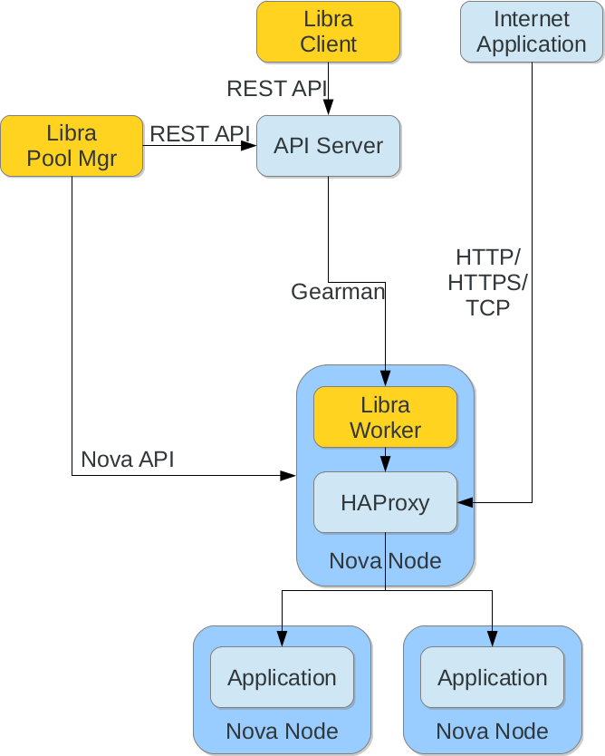

Introduction
============

Libra is a Load Balancer as a Service (LBaaS) system originally designed by
Hewlett-Packard Cloud Services.  It consists of five core components
required to get LBaaS working:

* A node pool manager to keep a warm spare pool of load balancers ready
* A node worker to asynchronously communicate to the API server
* A monitoring system for the load balancers
* A customer API server
* An administrative API server

The API server is based on a modified version of the `Atlas API specification
<https://wiki.openstack.org/wiki/Atlas-LB>`_.

Layout
------

Here you can see that the pool manager spins up the required Nova nodes with
the load balancer image.  It then hands the details of these nodes over to the
Admin API server.

The client sends an API request to the API server, which in turn sends the
configuration information to the worker on the load balancer node.  The worker
has a plugin system to speak to multiple load balancer types but is currently
designed to use HAProxy.

The statsd monitoring system routinely probes the workers and can alert on as
well as disable faulty nodes.

The parts of this diagram in orange are provided by the Libra codebase.
